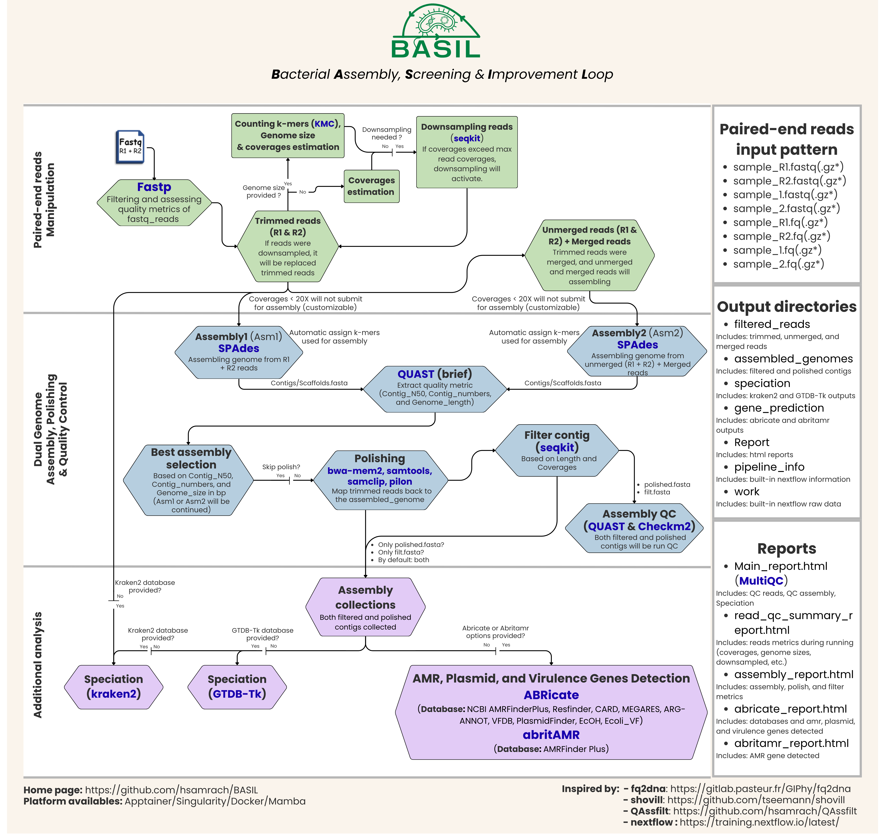

# Under construction


BASIL is a NextFlow workflow for bacterial genome analysis of paired-end Illumina reads that integrates pre-assembly, assembly, and post-assembly strategies to improve de novo genome assembly. It is inspired by existing tools such as [fq2dna](https://gitlab.pasteur.fr/GIPhy/fq2dna), [shovill](https://github.com/tseemann/shovill), and [QAssfilt](https://github.com/hsamrach/QAssfilt). 

In addition to assembly, BASIL also provides downstream analyses, including species identification and the detection of antimicrobial resistance (AMR), plasmid, and virulence genes, making it suitable for bacterial genomicers. To improve AMR interpretation, results from five databases (NCBI AMRFinderPlus, CARD, ARG-ANNOT, ResFinder, and AMRFinderPlus_abritamr) are compared and combined into a consensus output for easier review. BASIL also supports the integration of metadata with genomic results.

At each step of the process, important information is summarized in the interactive HTML report, allowing users to easily track and evaluate the workflow’s performance and the genomic result.
# Contents
- [Workflow Diagram](#workflow-diagram)
- [Quick tips](#quick-tips)
- [Installation](#installation)
- [Options](#options)
- [Databases](#databases)
- [Containers available](#containers-available)
- [Mamba](#mamba)
- [Dependencies](#dependencies)
- [Authors](#authors)
# Workflow Diagram


# Quick tips
This is the fittest command that we tested in our HPC with resources 64 CPUs and 1GB RAM.
```
basil --reads_dir /path/fastq_dir --outdir /path/output_1 --cpus8 --ram 120 --parallel_run 8 --checkm2_db /path/checkm2_database/uniref100.KO.1.dmnd/ --kraken2_db /path/kraken2_database/ --gtdbtk_db /path/gtdbtk_database/ --abricate_opt "-t 16" --abritamr_opt "-j 16" -profile mamba --genome_size 5000000
```
# Installation
## Install via conda or mamba
This is a ready-to-use installation that automatically installs Nextflow and BASIL together in one command.
```
conda(mamba) create -n basil_env -c samrachhan11 -c conda-forge -c bioconda -c defaults basil=1.0 -y
conda(mamba) activate basil_env
basil --help # show help
```
## Manual installation
First, you need to install Nextflow. Please see their instruction via this link: https://docs.seqera.io/nextflow/install
Then, you can clone our repository:
```
git clone https://github.com/hsamrach/BASIL.git
cd BASIL
```
Finally, you can run with nextflow command:
```
nextflow run basil.nf --help # show help
```
# Options
```
    Usage: basil --reads_dir <reads_directory> [options]
           basil --reads_tsv <samples.tsv> [options]
           basil --r1 <read1.fastq(.gz)> --r2 <read2.fastq(.gz)> [options]
           basil --contigs_dir <contigs_directory> [options]

    Input/Output:
    --r1 FILE                           Input read 1 file (default: null)
    --r2 FILE                           Input read 2 file (default: null)
    --reads_dir DIR                     Directory containing paired-end reads (default: null)
    --reads_tsv FILE                    TSV file with columns: sample, read1, read2 (default: null)
    --contigs_dir DIR                   Directory containing pre-assembled contigs (.fasta, .fas, .fa, .fna) (default: null)
    --dir_depth N                       Depth of directory for searching reads in --reads_dir (default: 1)
    --outdir DIR                        Output directory (default: BASIL_out)

    Paired-end QC:
    --pe_quality_fail_rate N            Maximum percentage of low-quality bases allowed (default: 40)
    --pe_min_length N                   Minimum read length required (default: 50)
    --pe_base_depth N                   Phred score threshold for qualified bases (default: 15)
    --pe_no_correction                  Disable read correction for paired-end reads (default: enabled)
    --pe_extra_opt "STRING"             Extra fastp options — note: 5 options are already used by default (start with pe_*)
    --min_genome_cov N                  Minimum genome coverage for pass assembly (default: < 20)
    --max_genome_cov N                  Maximum genome coverage for downsampling (default: > 150)
    --genome_size N                     Expected genome size. e.g. --genome_size 5000000 (Automatically calculate if not provided)

    Assembly analysis:
    --asm_used "STRING"                 SPAdes output to use for downstream analysis (choices: contigs/scaffolds, default: contigs)
    --min_contig_length N               Minimum contig length for filtered assembly (default: ≤ 300)
    --min_contig_cov N                  Minimum contig coverage for filtered assembly (default: ≤ 2)
    --skip_polish                       Skip polishing step (default: disabled)
    --only_filtered                     Only filtered contigs will be submitted to process speciation, and gene prediction (default: disabled)
    --only_polished                     Only polished contigs will be submitted to process speciation, and gene prediction (default: disabled)
    --checkm2_db FILE                   Path to CheckM2 database (mandatory) "/path/checkm2_database/uniref100.KO.1.dmnd/" (saved for future runs)
    --kraken2_db DIR                    Path to Kraken2 database (saved for future runs, auto-runs if available)
    --gtdbtk_db DIR                     Path to GTDB-Tk database (saved for future runs, auto-runs if available)
    --minid_genes N                     Minimum identity for abricate & abritamr (default: 90)
    --mincov_genes N                    Minimum coverage for abricate (default: 90). abritamr is constantly used 90% coverage (unmodifiable).
    --mutation "STRING"                 Provide species name for point mutation analysis by abritamr (default: null)
                                        Available species: "Acinetobacter_baumannii,Burkholderia_cepacia,Burkholderia_pseudomallei,
                                        Burkholderia_mallei,Campylobacter,Citrobacter_freundii,Clostridioides_difficile,
                                        Corynebacterium_diphtheriae,Enterobacter_asburiae,Enterobacter_cloacae,Enterococcus_faecalis,
                                        Enterococcus_faecium,Escherichia,Klebsiella_oxytoca,Klebsiella_pneumoniae,Neisseria_gonorrhoeae,
                                        Neisseria_meningitidis,Pseudomonas_aeruginosa,Salmonella,Serratia_marcescens,Staphylococcus_aureus,
                                        Staphylococcus_pseudintermedius,Streptococcus_agalactiae,Streptococcus_pneumoniae,Streptococcus_pyogenes,
                                        Vibrio_cholerae,Vibrio_vulfinicus,Vibrio_parahaemolyticus"

    Resources control:
    --meta_merge "f1.csv,f2.xls,..."    Merge metadata and genomic output file (.xlsx, .xls, .tsv, .csv, .tab) (default: null)
                                        Use it independently.
    --parallel_run N                    Number of sample runs in parallel (default: 1)
    --cpus N                            CPUs in GB per sample (default: 8)
    --ram N                             RAM in GB per sample (default: 16)
    -resume                             Resume work (built-in nextflow function)
    -profile "STRING"                   Alternative use of profile platform (choices: apptainer/singularity/docker/mamba, default: apptainer)
    --clear_saved_db "STRING"           Clear saved database paths (choices: checkm2, kraken2, gtdbtk, all)
    --version                           Show version and exit
    --help                              Show this help message and exit
```
## --min_genome_cov
The genome coverage under this value will not be submitted to assembly but its fastq reads will run Kraken2 as usual.
## --max_genome_cov
The genome coverage more than this value will be downsampled to meet this value only.
```
For example:
--max_genome_cov 150
So, 200 coverages of reads will be reduced to 150 coverages using the downsampling method.
```
# Databases
Once you specify the database path for each tool, the path will be saved, so you won't need to enter it again for the next run. Meanwhile, you can also overwrite or clear the saved database paths at any time.
## CheckM2 database (Mandatory)
Without CheckM2 database, BASIL won't run!

You can download CheckM2 database through their provided instruction: https://github.com/chklovski/CheckM2#databases.

Alternatively, you can use the command below to automate the download and decompression.
```
wget -O checkm2_database.tar.gz "https://zenodo.org/records/14897628/files/checkm2_database.tar.gz?download=1" && \
tar -xzf checkm2_database.tar.gz && \
rm -f checkm2_database.tar.gz
```
## GTDB-Tk database (Optional)
For GTDB-Tk, you can download their pre-built database through the command below:
```
wget https://data.ace.uq.edu.au/public/gtdb/data/releases/latest/auxillary_files/gtdbtk_package/full_package/gtdbtk_data.tar.gz && \
tar -xzf gtdbtk_data.tar.gz && \
rm -f gtdbtk_data.tar.gz
```
## Kraken2 database (Optional)
For Kraken2, you can download their pre-built database through this link with your preferred database: https://benlangmead.github.io/aws-indexes/k2
# Containers available
## Apptainer/Singularity/Docker
User can specify their runtime container using -profile "STRING".
# Mamba
In addition to containerized based, Mamba is also supported for users who already have it installed. (-profile mamba)

# Dependencies
- [fastp](https://github.com/opengene/fastp)=1.1.0
- [seqkit](https://github.com/shenwei356/seqkit)=2.13.0
- [multiqc](https://github.com/MultiQC/MultiQC)=1.31
- [pandas](https://github.com/pandas-dev/pandas)=3.0.1
- [openpyxl](https://pypi.org/project/openpyxl/)=3.1.5
- [samtools](https://github.com/samtools/samtools)=1.23
- [bwa-mem2](https://github.com/bwa-mem2/bwa-mem2)=2.3
- [spades](https://github.com/ablab/spades)=4.2.0
- [quast](https://github.com/ablab/quast)=5.3.0
- [kmc](https://github.com/refresh-bio/KMC)=3.2.4
- [samclip](https://github.com/tseemann/samclip)=0.4
- [pilon](https://github.com/broadinstitute/pilon)=1.24
- [kraken2](https://github.com/DerrickWood/kraken2)=2.1.6
- [gtdbtk](https://github.com/Ecogenomics/GTDBTk)=2.5.2
- [checkm2](https://github.com/chklovski/CheckM2)=1.1.0
- [abricate](https://github.com/tseemann/abricate)=1.4.0
- [abritamr](https://github.com/MDU-PHL/abritamr)=1.3.0

Please cite each of these tools if you are using this workflow.
# Authors
**Citation: Han S., Gonnella G., Guillard B., Cheng S., Rahi P. (2026). BASIL. GitHub: https://github.com/hsamrach/BASIL**
